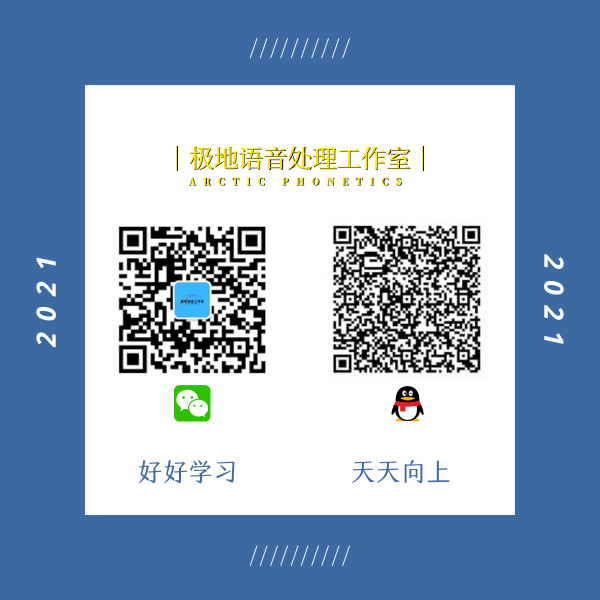

# Python-linguistics
这个项目主要和语言学专业的数据处理，包括但不限于语音、文本等方面，使用Python的一些脚本和技巧，同时也面向初学者，提供短小精悍的一些练手学习的脚本。
> 欢迎关注公众号：极地语音工作室；
> CSDN博客：[https://blog.csdn.net/shaopengfei](https://blog.csdn.net/shaopengfei)  

说明：每一部分为一个主题，第一部分适合初学者练手；第二部分每一小部分为一个主题；第三部分为；  

## 第〇部分 相关文档

* [Ubuntu 20.04.3 Anaconda安装及Python多版本虚拟环境配置](https://blog.csdn.net/shaopengfei/article/details/123440125)
* [VS Code中使用Python相对路径问题](https://blog.csdn.net/shaopengfei/article/details/123454659)
## 第一部分 入门脚本
本部分的脚本多为10行以内的代码量，主要目的是针对一个小小的知识点，了解一个概念或者一个用法。更适合于学习者了解某一个点的语法知识。   

### [P01-001](Part-01/src/p01_001_hello_world.py) 
* 学习编程语言第一步，学会打印hello, world!；
* Python可以使用单引号，也可以使用双引号；
* 如果在引号内部有引号，注意使用不同的就可以了；
* 如果必须使用相同的符号，那么需要加转义符号，斜杠；
* 笔者习惯于所有引号位置都使用单引号，内部使用双引号； 

### [P01-002](Part-01/src/p01_002_read_simple.py) 
* 读文本内容，并打印在屏幕上  

### [P01-003](Part-01/src/p01_003_internal_function_of_dict.py)
* 字典的内置函数
* dict.clear()清除字典
* dict.get()搜索字典，如果发现返回关联的值。如果未找到，则返回None
* dict.items(), 返回字典中的键值对列表
* dict.keys(), dict.values(), 返回字典的键和值的列表
* dict.pop(), 从字典中删除一个键
* dict.popitem(), 从字典删除键值对，删除最后一个
* dict.update(), 将字典与另一个字典或可迭代的键值对合并

### [P01-004](Part-01/src/p01_004_merge_two_list_to_dict.py)
* 用三种方法将两个列表，转化为字典， 使用zip函数

### [P01-005](Part-01/src/p01_005_dict_orderby.py)
* 对字典列表，根据键，值进行排序

### [P01-006](Part-01/src/p01_006_string_list_orderby.py)
对字符串列表进行排序
* sort 与 sorted 区别

### [P01-007](Part-01/src/p01_007_string_orderby_byte.py)
以字节为单位获取字符串大小
* 如何获取字符串的字节数

### [P01-008](Part-01/src/p01_008_vscode_path_problem.py)
* VS Code中使用Python相对路径问题

## 第二部分 简单功能脚本
* 本部分的代码多为能实现一个简单的小功能。  

### [P02-001](Part-02/P02_001_ProgressBar) 进度条的一些实现形式
* p02_001_alive_progress_bar.py, 有一些动画效果的进度条
* p02_001_normal_progress_bar.py, 普通进度条
* p02_001_progress_bar_iterations.py, 用于定义迭代次数的进度条
* p02_001_progress_bar_with_time.py, 带时间进度条
* p02_001_tqdm_progress_bar.py, tqdm进度条

### [P02-002](Part-02/P02_002_Numpy) Numpy的一些学习知识点

### [P02-003](Part-02/P02_003_FileNameOrder/p02_003_001_file_name_order.py) 文件名排序问题

### [P02-004](Part-02/P02_004_Deep_Learning_from_Scratch) 《深度学习入门-基于Python的理论与实现》学习记录

### [P02-005](Part-02/P02_005_Pandas) Pandas的一些学习知识点

### [P02-006](Part-02/P02_006_Head_First_Python) 《Head First Python》学习记录

## 第三部分 音频处理

### [P03-001](Part-03/P03_001_read_wav/p03_001_read_wavform.py) 
* 基本的读取wav的操作

### [P03-002](Part-03/P03_002_wav_duration/p03_002_compute_wav_duration.py) 
* 计算一个音频目录里的wav文件的总时长和每个文件的时长。

## 第四部分 文本处理

### [P04-001](Part-04/P04_001_WordSegment)  前后项分词

## 第五部分 Praat标注相关

### [P05-001](Part-05/P05_001_check_file_numbers/p05_001_check_file_numbers.py)  
* 检查两个目录里文件对应情况，分别保存两个目录都有的文件，每个目录独有的文件，以及上述文件的log
* 更多说明移步CSDN博客：[阅读原文](https://blog.csdn.net/shaopengfei/article/details/123454659)

## 第六部分 算法学习

## 参考文档
* [Python - 100天从新手到大师](https://github.com/jackfrued/Python-100-Days)